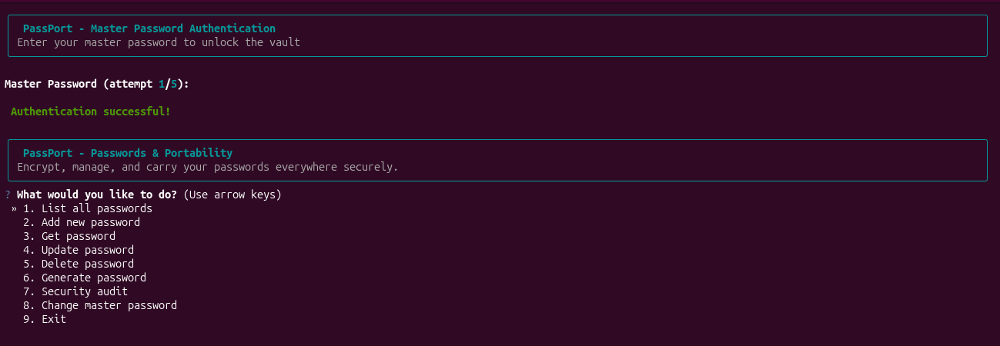
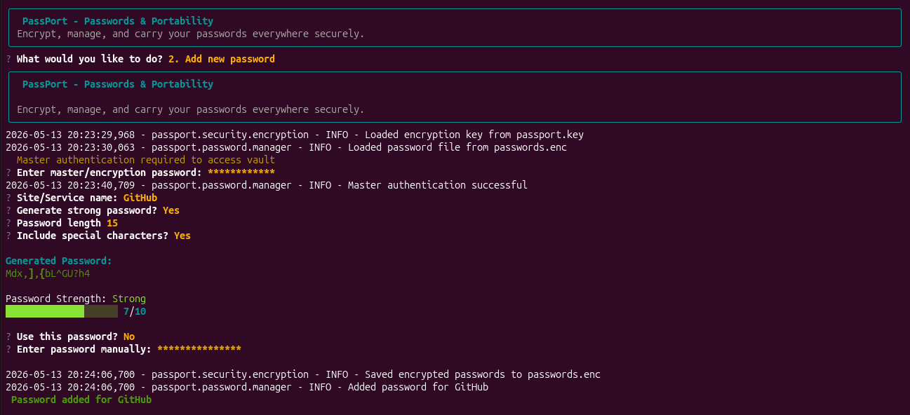
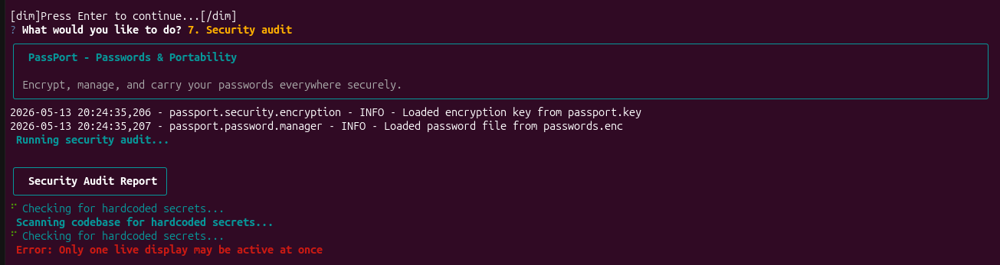
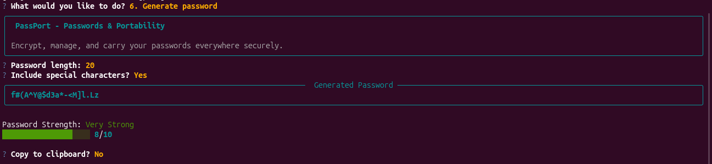

# PassPort - Passwords & Portability


> **Encrypt, manage, and carry your passwords everywhere securely.**

PassPort is a command line interface password manager that creates secure passwords, encrypts your login information locally, and works as an application on your desktop. Just your passwords, fully encrypted and portable. No cloud, subscriptions, or tracking.

---

## Table of Contents
- [Why PassPort?](#-why-passport)
- [Security Features](#-security-features)
- [Installation](#-installation)
- [Usage Guide](#-usage-guide)
- [Application User Interface View](#-application-user-interface-view)
- [Project Structure](#-project-structure)
- [License](#-license)
- [Acknowledgments](#-acknowledgments)
- [Contact](#-contact)

---

## Why PassPort?

Most password managers either store your data in the cloud or are complicated to use. PassPort is different:


- **Local Storage** — Your passwords never leave your machine. PassPort keeps everything local.

- **No Account Required** — Start using PassPort immediately. No email registration, no subscription, no master account.

- **Native Desktop Integration** — PassPort appears in your application menu with a custom icon. Launch it like any other app.

- **Interactive CLI** — Arrow key navigation, colored tables, progress spinners, and visual strength meters.

- **Built in Security Audit** — Scans for weak passwords, aged credentials, and security issues. 

- **100% Open Source (MIT)** — Free forever for personal and commercial use. Full source code available.

- **Runs Offline** — Works completely without internet. No sync servers, no cloud dependencies.

- **Zero Server Dependencies** — No backend infrastructure. No databases. No APIs. Just you and your encrypted file.

---

## Security Features

- **AES-128 Encryption**: Fernet symmetric encryption for all stored passwords
- **PBKDF2 Key Derivation**: 100,000 iterations with SHA-256 and random 32-byte salt
- **Dual Authentication**: Separate app login and vault encryption passwords
- **Rate Limiting**: 5 failed attempts trigger 15 minute lockout
- **Input Sanitization**: Protection against injection attacks
- **Secure Comparison**: Constant time password verification to prevent timing attacks

---

## Installation

### Prerequisites
- Python 3.8 or higher
- pip package manager
- Linux, macOS, or Windows

### Quick Install

```bash
# Clone the repository
git clone <https://github.com/tazbikislam/PassPort.git>
cd PassPort

# Create virtual environment
python -m venv .venv
source .venv/bin/activate  # Windows: .venv\\Scripts\\activate

# Install PassPort
pip install -e .
```

### Install From The Source

```bash
git clone <https://github.com/tazbikislam/PassPort.git>
cd PassPort
pip install -r requirements.txt
python -m passport.main
```

---

## Usage Guide

```bash
# Run PassPort
PassPort

# Then:
# 1. Create app master login password (to open PassPort)
# 2. Create master encryption password (to secure your vault)
# 3. Run PassPort again and enter your master login password to enter.
```

---

## Application User Interface View

<p>
  
  <br>
  <em>Fig 1: Interactive Main Menu</em>
</p>

##

<p align="center">
  
  <br>
  <em>Fig 2: Adding a new password</em>
</p>

##

<p align="center">
  
  <br>
  <em>Fig 3: Security Auditing</em>
</p>

##

<p align="center">
  
  <br>
  <em>Fig 4: Generating a Random Secure Password option</em>
</p>

---

## Project Structure

```
PassPort/
├── passport/                    
│   ├── authentication/          
│   │   └── auth_manager.py      
│   ├── security/                
│   │   ├── encryption.py        
│   │   ├── sanitizer.py         
│   │   ├── rate_limiter.py      
│   │   └── auditor.py           
│   ├── password/                
│   │   ├── manager.py           
│   │   ├── generator.py         
│   │   └── tracker.py           
│   ├── cli/                     
│   │   ├── commands.py          
│   │   └── interactive.py       
│   └── utils/                   
│       └── animations.py        
├── icons/                       
├── setup.py                     
├── requirements.txt             
├── .env.example                 
├── .gitignore                   
├── LICENSE                      
└── README.md                    
```

---

## License

This project is licensed under the MIT License [LICENSE]([https://www.notion.so/LICENSE](https://github.com/tazbikislam/PassPort/blob/main/LICENSE))

**Free for personal and commercial use.**

---

## Acknowledgments

- [Typer](https://typer.tiangolo.com/) — CLI framework
- [Rich](https://github.com/Textualize/rich) — Terminal formatting
- [Cryptography](https://cryptography.io/) — Encryption library
- [Questionary](https://github.com/tmbo/questionary) — Interactive prompts

---

## Contact

- **Email**: [tazbikislam.work@gmail.com](mailto:tazbikislam.work@gmail.com)
